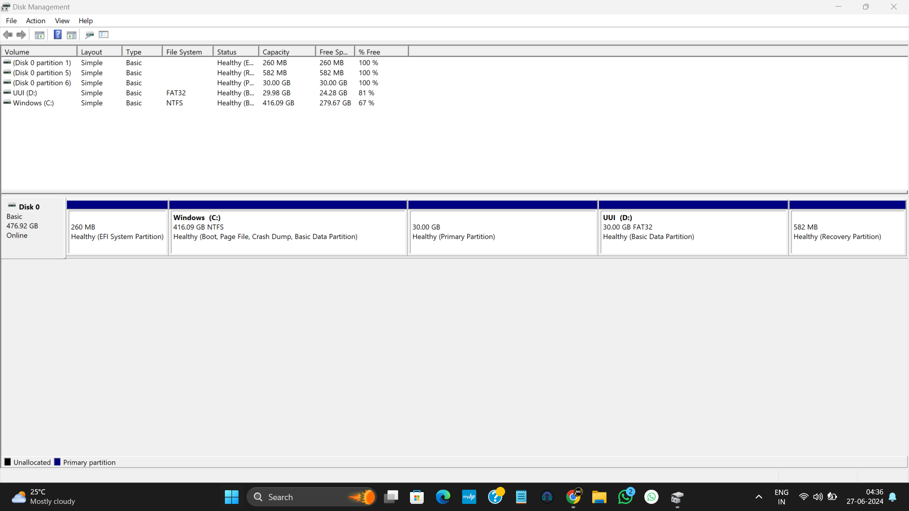
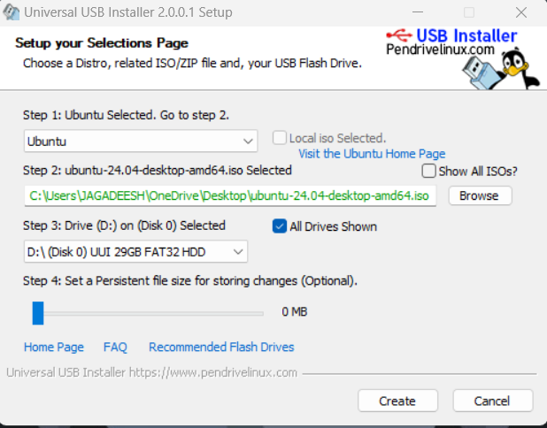
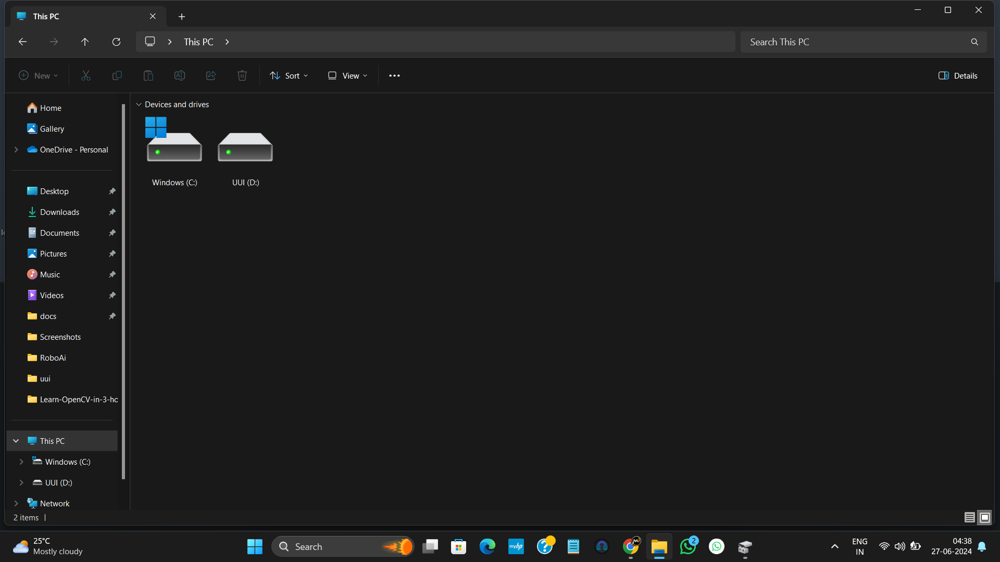

# Dual Boot Ubuntu 24.04 LTS with Windows

This guide will walk you through the process of dual booting Ubuntu 24.04 LTS with Windows.

## Prerequisites

1. Download the latest Ubuntu version from [here](https://ubuntu.com/download/desktop).
2. Download Universal USB Installer 2.0.0.1 from [here](https://www.filehorse.com/download-universal-usb-installer/60048/download/).

## Preparing Windows

1. **Open Disk Management:**
   - Press `Windows + X` or right-click on Start and select `Disk Management`.

2. **Shrink an Existing Volume:**
   - Right-click on an existing volume and select `Shrink Volume`.
   - Do not exceed 32GB to keep the FAT32 file system option available.
   - Create unallocated memory.

3. **Create a New Simple Volume:**
   - Right-click on the newly created unallocated space and select `New Simple Volume`.
   - Follow the wizard, assign a drive letter, change the file system to `FAT32`, and label the volume (e.g., `ubuntu_iso`).

4. **Create Additional Unallocated Memory:**
   - Shrink another volume to create additional unallocated space for Ubuntu installation.

5. **Disk Management Overview:**
   - At the end, your Disk Management should have an unallocated space for Ubuntu.

   

## Creating a Bootable USB

1. **Open Universal USB Installer:**
   - Select the distribution as `Ubuntu`.
   - Find and select your downloaded Ubuntu ISO file.
   - Tick the `Show All Drives` checkbox.
   - Select the drive letter assigned to your USB.
   - Click `Create`.
   - 
   

2. **Check USB Drive:**
   - Open `File Explorer` (This PC) to verify the bootable USB creation.

   

## Booting and Installing Ubuntu

1. **Restart and Enter Startup Menu:**
   - Restart your PC and press `Esc` to enter the Startup Menu.
   - Select `Boot Menu`.

2. **Select Boot from EFI File:**
   - Select `Boot from EFI File`.
   - Navigate to your USB drive (labelled as `FS0:` or similar).
   - Go to `EFI/BOOT/` and select `bootx64.efi`.

3. **Select UUI.Apci (if available):**
   - Navigate through `EFI -> BOOT`.
   - Select `bootx64.efi`.

4. **Start Ubuntu Installer:**
   - On the black screen, select `Try or Install Ubuntu`.

## Ubuntu Installation

1. **Proprietary Software Installation:**
   - When prompted, tick both options:
     - `Install the 3rd party software for graphics and wifi hardware`
     - `Download and install support for additional media formats`

2. **Installation Type:**
   - Choose how to install Ubuntu:
     - `Install Ubuntu alongside Windows Boot Manager` (for dual boot)
     - `Erase disk and install Ubuntu` (to remove Windows and install Ubuntu)

3. **Finish Installation:**
   - Follow the prompts to set up your username and password.
   - Complete the installation process.

## Post Installation

- Your dual boot setup is ready.
- You can access Windows files from Ubuntu.

---

This guide helps you dual boot Ubuntu 24.04 LTS with Windows. Remember to back up your data before starting the process.

